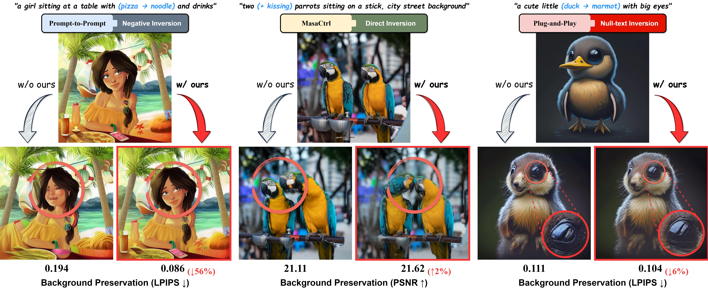
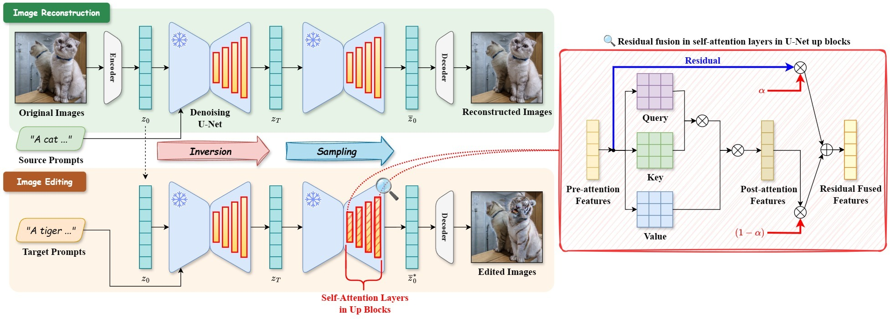
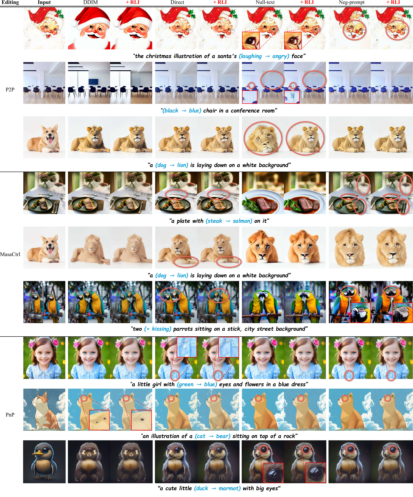
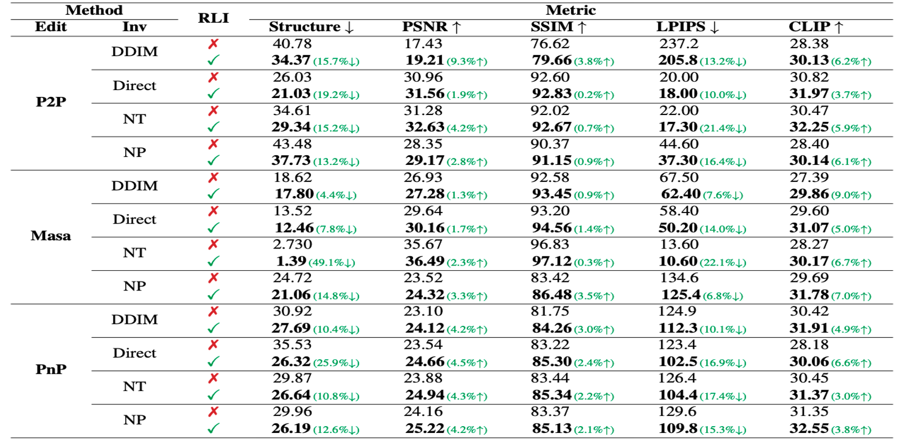

# RLI: Residual Learning in Inversion for Image Editing

<div align="center">

### [Paper](https://github.com/ugiugi0823/RLI) | [Project Page](https://ugiugi0823.github.io/RLI/)

</div>

---

## 📢 Abstract

본 연구는 텍스트 기반 이미지 편집에서 배경 보존 문제를 해결하기 위한 새로운 접근법을 제안합니다. 기존의 Diffusion 기반 편집 방법들(Prompt-to-Prompt, MasaCtrl, Plug-and-Play 등)은 목표 객체를 편집할 때 의도하지 않은 배경 변화가 발생하는 문제가 있습니다. 

우리의 방법인 **RLI (Residual Learning in Inversion)**는 U-Net의 Self-Attention Layer에서 Residual Fusion을 적용하여 이 문제를 효과적으로 해결합니다. 실험 결과, 제안된 방법은 다양한 편집 방법(P2P, MasaCtrl, Null-text Inversion, Negative-prompt Inversion 등)에 적용 가능하며, 배경 보존 성능을 크게 향상시킵니다.

<p align="center">
  
  <br>
  <em>다양한 편집 방법들과의 배경 보존 성능 비교. RLI를 적용한 경우 (w/ ours) 배경이 더 잘 보존됩니다.</em>
</p>

---

## 🔍 Method

우리의 방법은 두 가지 주요 단계로 구성됩니다:

1. **Image Reconstruction**: 원본 이미지를 Denoising U-Net을 통해 재구성합니다.
2. **Image Editing**: 타겟 프롬프트를 사용하여 이미지를 편집하며, Self-Attention Layer의 Up Blocks에서 Residual Fusion을 적용합니다.

핵심 아이디어는 **Self-Attention Layer에서 Residual을 학습**하는 것입니다. Query, Key, Value를 통한 기존 attention 결과에 residual을 가중치(α)로 융합하여 배경 정보를 보존합니다.

<p align="center">
  
  <br>
  <em>제안된 RLI 프레임워크. U-Net의 Self-Attention Layer에서 Residual Fusion을 적용합니다.</em>
</p>

---

## 🎨 Qualitative Results

다양한 편집 시나리오에서 RLI의 효과를 확인할 수 있습니다. 여러 baseline 방법들(P2P, MasaCtrl, PnP 등)에 RLI를 적용했을 때, 편집 영역 외의 배경이 더욱 잘 보존되는 것을 볼 수 있습니다.

<p align="center">
  
  <br>
  <em>다양한 편집 방법들에 RLI를 적용한 정성적 결과. 붉은 원은 의도하지 않은 변화를 나타냅니다.</em>
</p>

---

## 📊 Quantitative Results

정량적 평가에서도 RLI는 일관되게 성능 향상을 보여줍니다. 특히:
- **Structure Distance (↓)**: 구조 보존 향상
- **PSNR (↑)** 및 **SSIM (↑)**: 이미지 품질 향상
- **LPIPS (↓)**: 지각적 유사도 향상
- **CLIP Score (↑)**: 텍스트-이미지 정합성 향상

<p align="center">
  
  <br>
  <em>다양한 편집 방법에 RLI를 적용한 정량적 결과. 녹색 체크는 RLI 적용을 의미합니다.</em>
</p>

모든 메트릭에서 RLI를 적용했을 때 성능이 개선되었으며, 특히 배경 보존 관련 지표(Structure Distance, LPIPS)에서 큰 향상을 보였습니다.

---

## 🚀 Getting Started

### 🌐 웹사이트 방문

**라이브 데모**: [https://ugiugi0823.github.io/RLI/](https://ugiugi0823.github.io/RLI/)

### 💻 로컬 개발 환경 설정

```bash
# 1. 저장소 클론
git clone https://github.com/ugiugi0823/RLI.git
cd RLI

# 2. 의존성 설치
npm install

# 3. 개발 서버 실행
npm run dev
```

브라우저에서 http://localhost:5173 접속

### 📦 빌드 및 배포

```bash
# 빌드
npm run build

# 배포 (GitHub Pages)
npm run deploy
```

상세한 배포 가이드는 [DEPLOY_REACT.md](DEPLOY_REACT.md)를 참고하세요.

### 🐍 Python 환경 (연구 코드용)

```bash
# Conda 환경 생성
conda create -n wxxk python=3.8
conda activate wxxk

# Python 패키지 설치
pip install -r requirements.txt
```

### Usage

```python
# Coming soon
```

---

## 📝 Citation

본 연구가 유용하셨다면 다음과 같이 인용해 주세요:

```bibtex
@inproceedings{rli2025,
  title={RLI: Residual Learning in Inversion for Image Editing},
  author={Your Name},
  booktitle={ICCV Workshop},
  year={2025}
}
```

---

## 🙏 Acknowledgements

This work was supported by [Your Institution/Grant].

---

## 📧 Contact

For questions and discussions, please open an issue or contact [your-email@example.com].

---

<div align="center">
  
**[ICCV Workshop 2025]**

</div>

